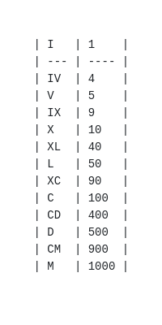

### Bônus

1 - (Difícil) Faça um programa que receba uma string em algarismos romanos e retorne o número que a string representa.
**Atenção! Esse exercício já apareceu no processo seletivo de uma grande multinacional!**

Dicas:
* Uma string é um array de caracteres, então cada elemento do array é uma letra.
* O valor de cada numeral romano é: 
* Que tal criar um objeto que associe cada letra a um numeral para fácil consulta?
* Atenção! Quando você tem um número pequeno à direita de um número grande, eles devem ser somados. Exemplo: XI = 10 + 1 = 11. No entanto, se o número pequeno está à esquerda de um número maior que ele, ele deve ser subtraído. Exemplo: IX = 10 - 1 = 9.

2 - Para o próximo exercício você irá precisar ter uma conta no `CodeWars`, para entender como fazê-lo acesse esse o [conteúdo](https://app.betrybe.com/course/real-life-engineer/code-wars) que fizemos sobre isso. Após seguir os passos para registro acesse o desafio proposto e então clique em `TRAIN`, você então será redirecionado para a página onde o desafio deve ser feito. Quando tiver finalizado o exercício clique em `TEST` para verificar, com testes simples, se sua solução satisfaz o que foi pedido. Passando nesses testes clique em `ATTEMPT`, ao fazer isso seu código passará por todos os testes existentes para validação da solução. Caso sua solução esteja correta o botão `SUBMIT` ficará disponível, clique nele para submeter sua resposta, caso contrário volte ao seu código e veja o que ainda não está satisfazendo o que se é pedido, repita esse processo até que sua solução esteja correta.

[Desafio - 16 + 8 = 214](https://www.codewars.com/kata/5effa412233ac3002a9e471d/javascript);
* Esse desafio irá exigir um pouco de conhecimento sobre alguns `métodos` do JavaScript, para isso pesquise quando for necessário e caso surja alguma dúvida peça ajuda no `Slack`. Dúvidas em como fazer uma boa pesquisa? Sem problemas! Acesse esse conteúdo sobre `como pesquisar como uma pessoa desenvolvedora`.
