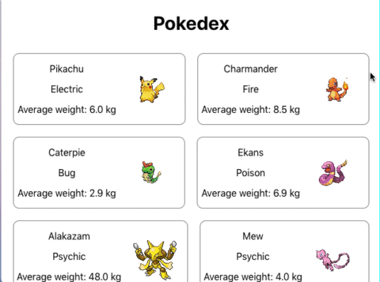

### Componentes React

O exercício consiste em implementar de forma simplificada uma Pokedex! A aplicação mostra todos os pokemons presentes no arquivo `data.js`.

##### Instruções para realização dos exercícios

Crie um novo projeto utilizando `npx create-react-app my-pokedex`.

Componentes obrigatórios:
- Pokemon: como o próprio nome diz, representa **um** pokemon. Esse componente recebe como entrada um objeto que contém informações referentes a um pokemon específico e retorna as seguintes informações (validadas utilizando PropTypes):
  * nome;
  * tipo;
  * peso médio, acompanhado da unidade de medida;
  * imagem.
- Pokedex: representa a enciclopédia de pokemons. Esse componente recebe como entrada uma lista de pokemons a serem mostrados na tela.

Segue uma sugestão de implementação da aplicação:

